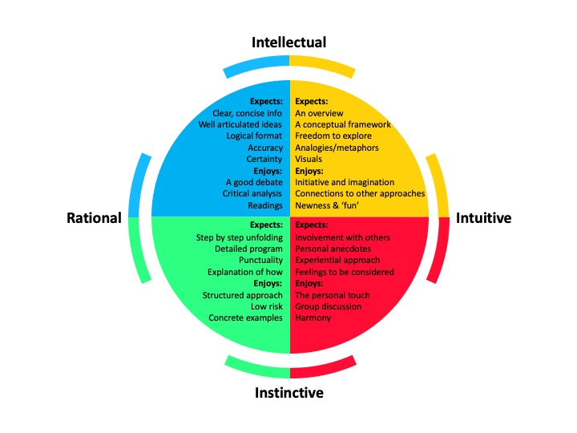

```{r setup, include=FALSE}
knitr::opts_chunk$set(echo = TRUE)
```

# Outline of manuscript

- Data Cleaning
- [Analysis](MeHg_Net_Loads.html)
- Discussion

# Nicole's New section

- this is where Nicole entered data
- this is where Nicole entered even more!

```{r graphics, fig.align = 'center', echo = FALSE}

```

